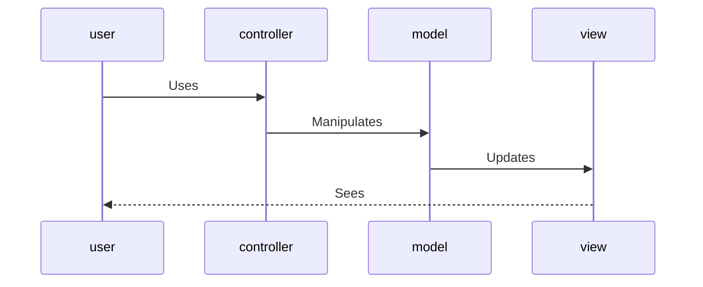
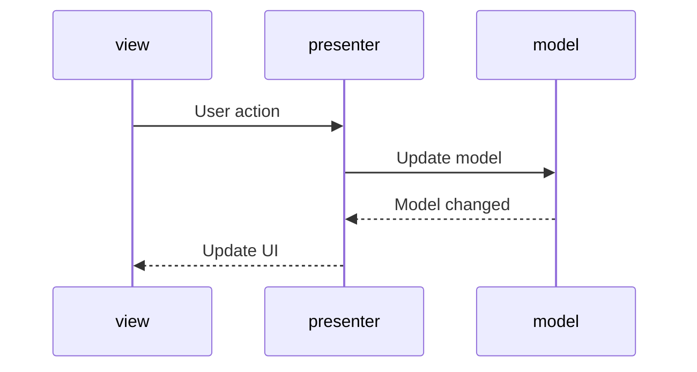
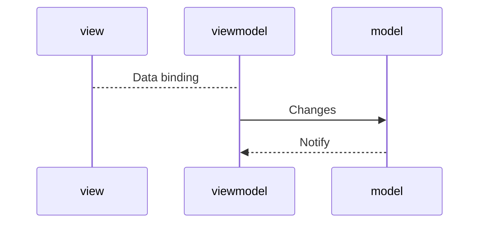
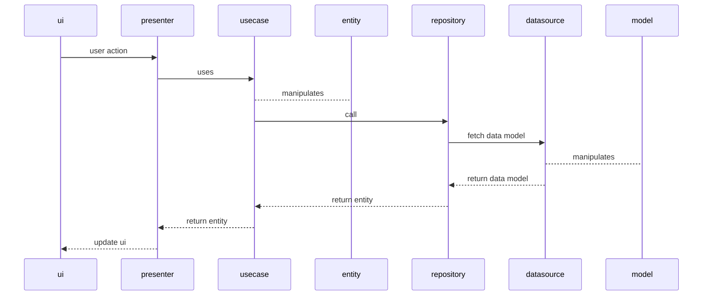
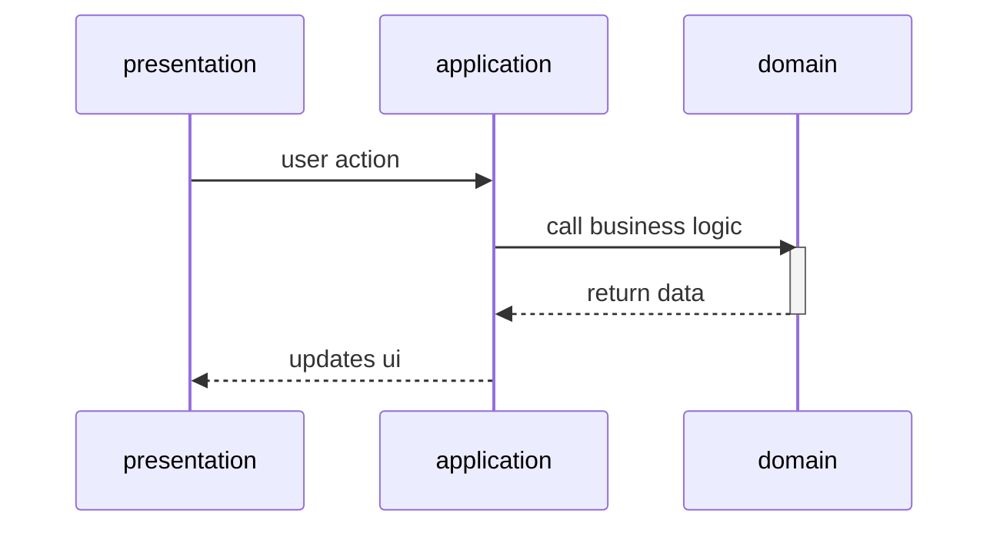

### MVC

```mermaid
sequenceDiagram
    participant user
    participant controller
    participant model
    participant view
    user->>controller: Uses
    controller->>model: Manipulates
    model->>view: Updates
    view-->>user: Sees
```

### MVP

```mermaid
sequenceDiagram
    participant view
    participant presenter
    participant model

    view->>presenter: User action
    presenter->>model: Update model
    model-->>presenter: Model changed
    presenter-->>view: Update UI
    
```

### MVVM

```mermaid
sequenceDiagram
    participant view
    participant viewmodel
    participant model

    view-->viewmodel: Data binding
    viewmodel->>model: Changes
    model-->>viewmodel: Notify
    
```

### The clean architecture

```mermaid
sequenceDiagram
    participant ui
    participant presenter
    participant usecase
    participant entity
    participant repository
    participant datasource
    participant model

    ui->>presenter: user action
    presenter->>usecase: uses
    usecase-->entity: manipulates
    usecase->>repository: call
    repository->>datasource: fetch data model
    datasource-->model: manipulates
    datasource-->>repository: return data model
    repository-->>usecase: return entity
    usecase-->>presenter: return entity
    presenter-->>ui: update ui
    
```

### The onion architecture

```mermaid
sequenceDiagram
    participant presentation
    participant application
    participant domain

    presentation->>application: user action
    application->>domain: call business logic
    activate domain
    domain-->>application: return data
    deactivate domain
    application-->>presentation: updates ui
```