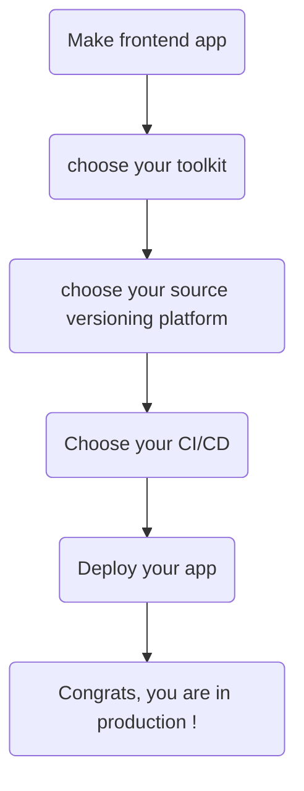
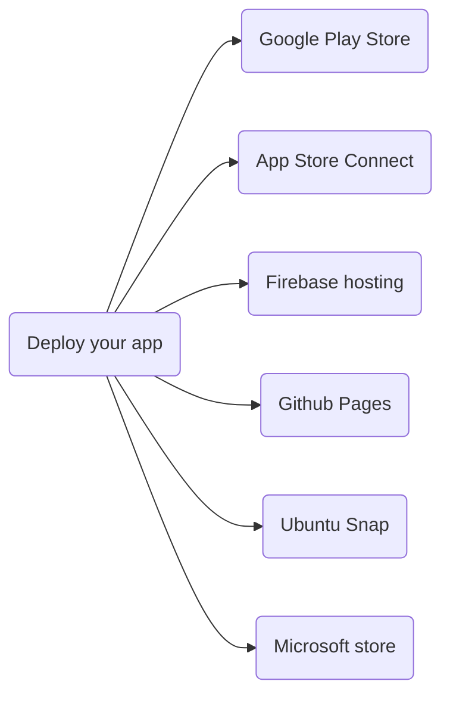

# The mobile cheat sheet

Today, make a mobile app can lost many people when they search how to build, test, maintaint and distribute theire app.

This repository aim to give some keys in some kind of cheat sheet to help people taking decisions about different aspects of an app.

## The global steps

First, make sure to understand the followin steps. Each mobile app development follows this steps.

## The dev toolkit

This is maybe the most important choice. Select the correct dev toolkit regarding several criterias.

If your don't know which one to choose, start by asking yourself :

* do I need to deploy my app on several platforms or only one ?
* is my target audience only on android, ios, web ?
* do I require the most moble experience ?
* will I use the device's capabilities like accelerometer, vibrations, NFC, bluetooth ?
* do I want the same experience over the all platform or not ?
* can I code my app once per platform ? do I want it ?
* does my team know or can learn required languages and skills ?

If you need to deploy on several systems or platforms, you may need an cross-platform toolkit.

If you only need to mak an Android or IOS app without any possibility to change target platform later, just use the native toolkit for better experience.

If you need to use the device's capabilities, consider using a cross platform that can make it easily or the native toolkit if you can code your app once per platform.

[See TOOLKIT.md](./TOOLKIT.md)

## The pattern

This is a must have for your app. Patterns keep your code organized and encourage good practices. MVC, MVP, MVVM, Clean architecture, Onion architecture. All of these names can be confusing. Feel free to go deeper in the pattern file.

[See PATTERN.md](./PATTERN.md)

## The CI/CD

Continuous Integration and Continuous Delivery provides automation of your tests, quality, good practices, packaging and deployments.

[See CICD.md](./CICD.md)

## The deployment

