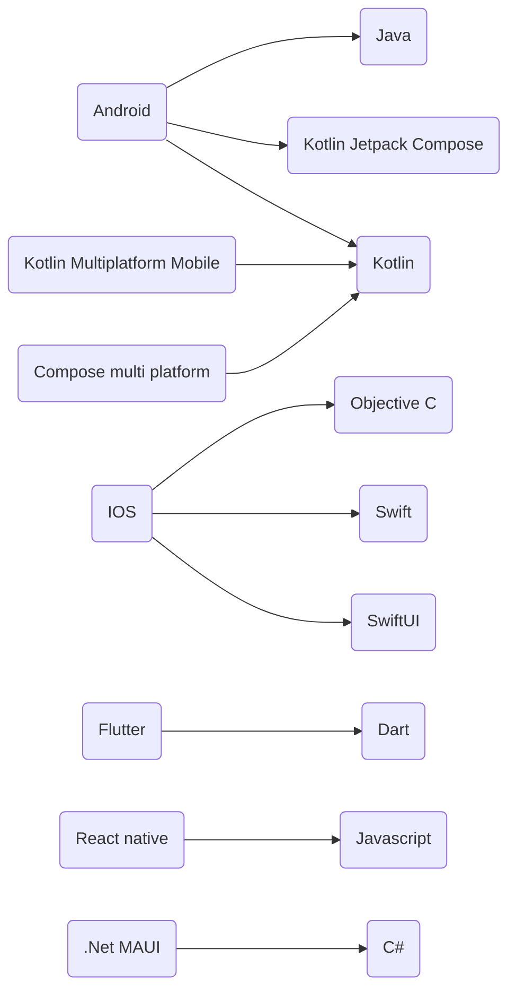
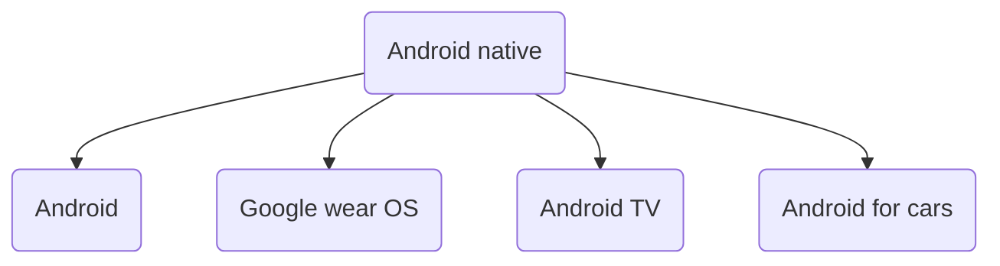
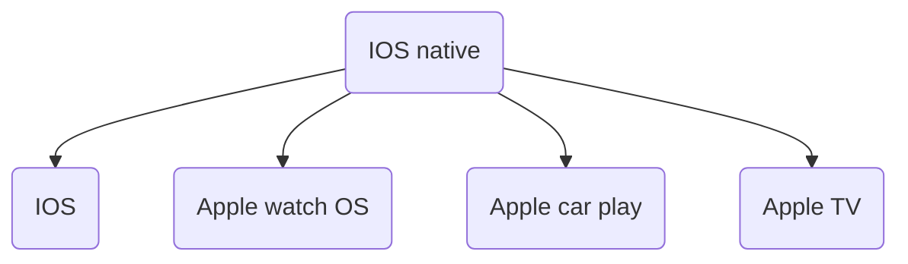
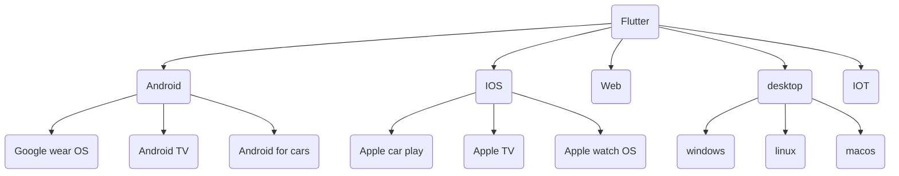
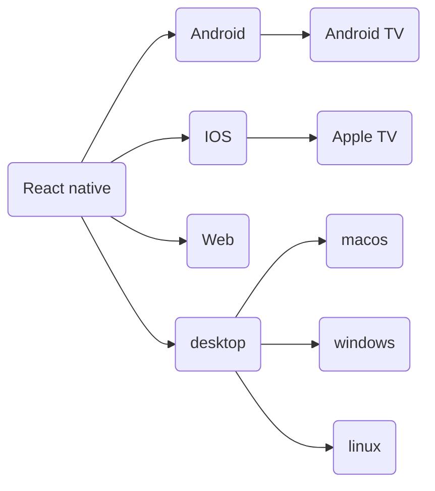
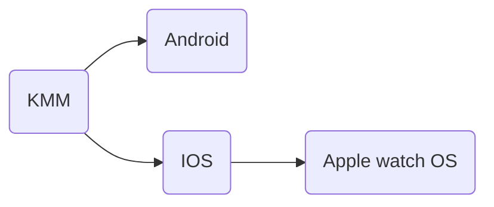
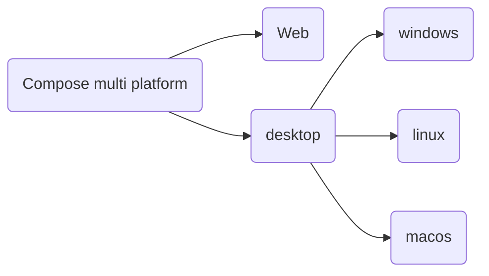
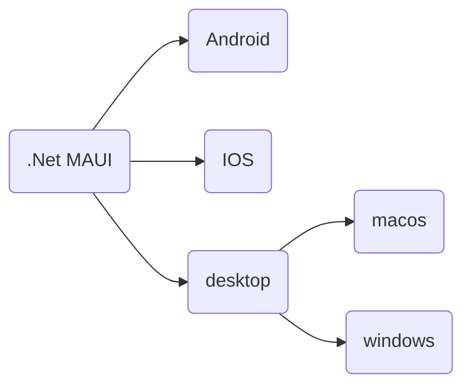

# Toolkit language

Each toolkit can use one or several languages. Make sure to know it or to be able to learn it easily with your team.

# Toolkit supported target platforms

## Android native

## IOS native

## Flutter

## React native

## KMM - Kotlin Multiplatform Mobile

## Compose multi platform

## .Net MAUI
